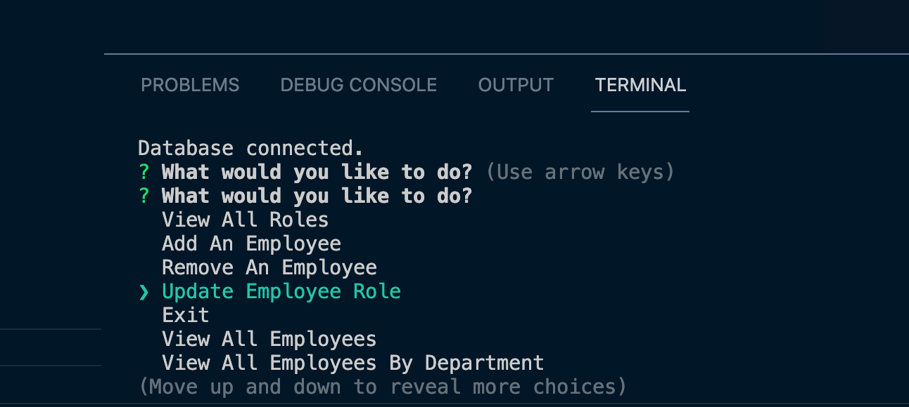

# Employee_trackr_SQL
## Project Title: 
<h1 align="center">Employee Tracker </h1>

## Description:

🔍 This app is a content management systems (CMS) that are interfaces that allow non-developers to easily view and interact with information stored in databases. 

## Table of Contents
- [Description](#description)
- [Installation](#installation)
- [Usage](#usage)
- [License](#license)
- [Contributing](#contributing)
- [Tests](#tests)
- [Questions](#questions)

## Installation
💾  Download or Clone File then npm install or npm i 
    

## Usage
💻  after download/clone and install, make a selection based on the prompted question.  

https://user-images.githubusercontent.com/92761848/152711879-634b427b-00a9-4e1b-b254-dece816563b7.mp4

https://user-images.githubusercontent.com/92761848/152711842-763b1d91-8bcd-499e-8ef4-d7001f2feede.mp4

Built with:

- Javascript
- Npm Inquirer
- MySQL
- Npm console.table
- Npm asciiart-logo

## Credits 
👪 Made by Irene with the help TA's, instructor @Trilogy,  Ethanlloyd21, cmelby and GOOGLE. 
